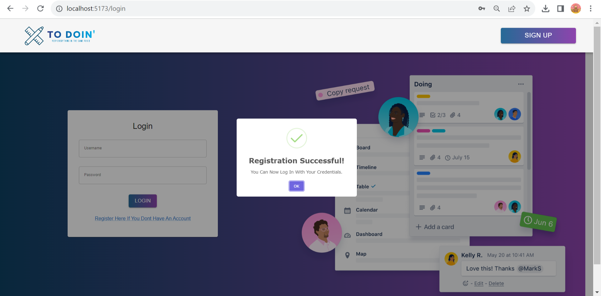
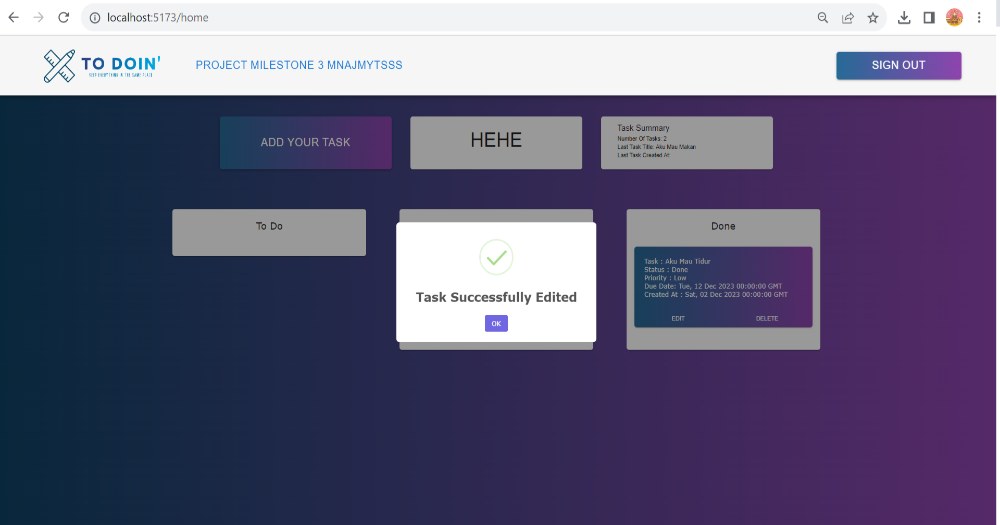

# Week 22 - Full Stack Project Using Flask and React

This is a full-stack project that combines a Flask Backend and a React Frontend, centered around a to-do list theme. Users can register account, log in, create, read, update, and delete lists on the to-do list.

In this project, the assignment involves converting the backend from JavaScript/TypeScript to Flask, integrating JWT token for secure authentication, implementing security headers and CORS, and integrating it with the React frontend.
Deploying a full-stack app on a VPS (Virtual Private Server), I use Firebase

## Features

- Login, Register

- Create, read, update and delete Todo List lists

## Key Features

- **Database**: I use Postgree Database.
- **JWT Authentication**: We use JSON Web Tokens (JWT) to securely authenticate users and maintain their session.
- **Security Headers**: To enhance the security of our application, we employ various security headers including Content-Security-Policy, Permissions-Policy, Referrer-Policy, Strict-Transport-Security, X-Content-Type-Options, and X-Frame-Options.
- **API Documentation**: All backend functionalities are well-documented using Postman, ensuring that developers can easily understand and interact with our API.
- **Firebase Deployment**: The entire application is deployed on Firebase, providing a reliable and scalable hosting solution.
- **Additional Considerations**: I also add Task Priority, Due Dates for lists and Data Validation on both Frontend and Backend.


## Users API Endpoint
### 1. Login
- **Function**: Login / sign in to website
- **Endpoint**: `POST /api/users/login`
- **Request**:
  ```json
  {
   "username": "mnajmytsss",
   "password": "user123#"
  }
  ```

### 1. Register
- **Function**: Login / sign in to website
- **Endpoint**: `POST /api/users/register`
- **Request**:
  ```json
  {
   "username": "mnajmytsss",
   "password": "user123#"
  }
  ```

## To do list API Endpoint
### 1. Get All lists
- **Function**: Get all to do list task
- **Endpoint**: `GET /api/lists`
- **Authorization**: `Bearer Token`

### 2. Add New Task
- **Function**: Add new to do list task
- **Endpoint**: `POST /api/lists`
- **Authorization**: `Bearer Token`
- **Body**:
  ```json
  {
  "title": "Task Title",
  "description": "Task Description",
  "status": "on progress",
  "priority": "LOW",
  "dueDate": "2023-12-31"
  }
  ```

### 3. Edit Task
- **Function**: Edit to do list task
- **Endpoint**: `PUT /api/lists/{taskId}`
- **Authorization**: `Bearer Token`
- **Body**:
  ```json
  {
  "status": "Updated Status",
  "priority": "Updated Priority",
  "dueDate": "2023-12-31"
  }
  ```

### 4. Delete Task
- **Function**: Delete to do list task
- **Endpoint**: `DELETE /api/lists/{listId}`
- **Authorization**: `Bearer Token`

## Security Headers

**Front End Security Header Score**


**Back End Security Header Score**


## Google Lighthouse Score


## Deployment Link

Front-End link 

Back-End / Server link 


<br>

<br>

<br>

